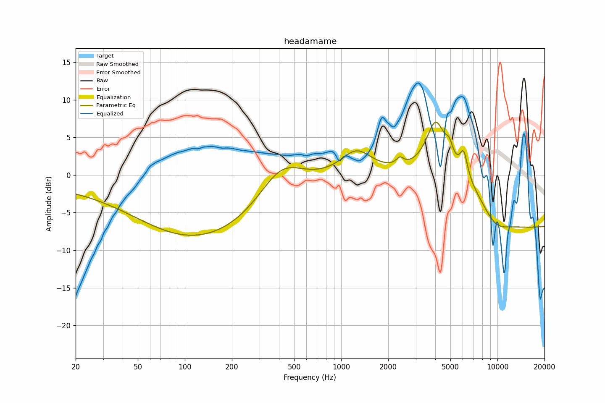

# headamame
See [usage instructions](https://github.com/jaakkopasanen/AutoEq#usage) for more options and info.

### Parametric EQs
You can use filters 1-5 or 1-10. Apply preamp of -7.3 dB or -7.1 dB, respectively.

|   # | Type      |   Fc (Hz) |    Q |   Gain (dB) |
|-----|-----------|-----------|------|-------------|
|   1 | LowShelf  |       105 | 0.7  |        -1.2 |
|   2 | Peaking   |       140 | 0.34 |        -8.1 |
|   3 | Peaking   |       414 | 0.98 |         4.9 |
|   4 | Peaking   |      1252 | 1.44 |         3.3 |
|   5 | Peaking   |      4032 | 2.3  |         7   |
|   6 | Peaking   |      2377 | 6    |         1   |
|   7 | Peaking   |      4922 | 5.98 |         1.8 |
|   8 | Peaking   |      6083 | 5.71 |         3.4 |
|   9 | Peaking   |      9540 | 1.26 |        -3.6 |
|  10 | HighShelf |     10000 | 0.7  |        -6.8 |

### Graphs

